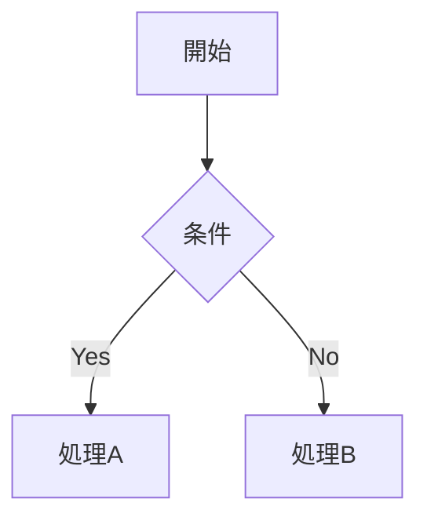

# docs-demo

GitHub Pages + Docsify を使用した、Markdown 技術設計書の共有例。

## 🚀 クイックスタート

### オンライン版（公開サイト）

```
https://ura148.github.io/docs-demo/
```

### ローカルプレビュー（開発用）

```bash
npm install -g docsify-cli
docsify serve docs
# http://localhost:3000 にアクセス
```

---

## 📁 ファイル構成

```
docs-demo/
├── README.md                        ← このファイル
├── .gitignore
└── docs/
    ├── index.html                   ← Docsify 設定・プラグイン定義
    ├── .nojekyll                    ← GitHub Pages の Jekyll 無効化
    ├── _sidebar.md                  ← 左サイドバー目次
    ├── _navbar.md                   ← グローバルナビゲーション
    ├── README.md                    ← トップページ
    ├── project-a/
    │   ├── README.md                ← プロジェクト概要
    │   ├── architecture.md          ← アーキテクチャ設計
    │   ├── flows.md                 ← 業務フロー（Mermaid図）
    │   └── apis.md                  ← API仕様
    ├── project-b/
    │   └── README.md                ← プロジェクト概要
    └── common/
        ├── glossary.md              ← 用語集
        ├── standards.md             ← 開発標準・規約
        └── faq.md                   ← よくある質問
```

---

## ✨ 機能一覧

### ナビゲーション
- **左サイドバー**：`_sidebar.md` で定義。プロジェクト・セクション単位の階層目次
- **グローバルナビ**：`_navbar.md` で定義。ページ上部のナビゲーションバー
- **ページ内目次（TOC）**：`docsify-toc` プラグインにより H2/H3 見出しを右側に自動表示
- **H3まで自動展開**：`subMaxLevel: 3` により見出し3階層をサイドバーに表示

### 検索
- **全文検索**：複数ファイルをまたいで横断検索（`paths: auto`、深さ3階層）
- キャッシュ有効期間：24時間

### 図式（Mermaid）
Markdown のコードブロック内に書くだけで図が描画されます。

| 図式の種類 | 用途 |
|-----------|------|
| フローチャート（`graph`） | 承認ワークフロー・業務フロー |
| ER図（`erDiagram`） | データモデル・オブジェクト関係 |
| シーケンス図（`sequenceDiagram`） | API連携フロー・処理順序 |
| ガントチャート（`gantt`） | プロジェクトスケジュール |

### アラート表示
`docsify-plugin-flexible-alerts` により、重要度別の注記ブロックが使用可能です。

```markdown
> [!NOTE]
> 補足情報

> [!TIP]
> 推奨事項・ヒント

> [!IMPORTANT]
> 重要な情報

> [!WARNING]
> 注意が必要な情報
```

### その他
- **絵文字サポート**：`:smile:` などの絵文字記法が使用可能
- **自動スクロール**：ページ遷移時に先頭へ自動スクロール
- **レスポンシブ対応**：モバイルでも閲覧可能

---

## 📖 使い方

### ドキュメントを追加する

1. 対象プロジェクトのフォルダ（例：`docs/project-a/`）に `.md` ファイルを作成
2. `docs/_sidebar.md` にリンクを追加
3. `git push`

### ドキュメントを編集する

1. `.md` ファイルを編集
2. `git push`
3. GitHub Pages が自動更新（数秒〜1分）

### Mermaid 図を書く

````markdown

````

---

## 🔧 GitHub Pages の設定

1. リポジトリの **Settings** → **Pages**
2. **Branch**：`main`、**Folder**：`docs`
3. Save

---

## 🤝 サポート

問題が発生した場合は [FAQ](docs/common/faq.md) を確認するか、GitHub Issues を作成してください。
