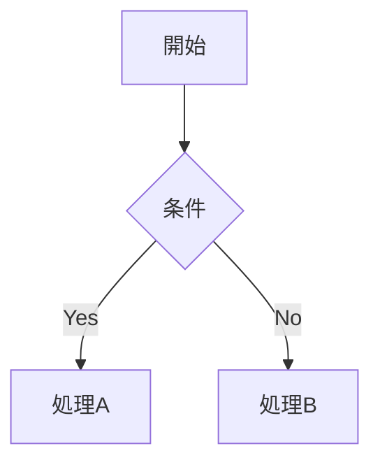

# 機能一覧

## ナビゲーション

- **左サイドバー**：`_sidebar.md` で定義。プロジェクト・セクション単位の階層目次
- **グローバルナビ**：`_navbar.md` で定義。ページ上部のナビゲーションバー
- **ページ内目次（TOC）**：`docsify-toc` プラグインにより H2/H3 見出しを右側に自動表示
- **H3まで自動展開**：`subMaxLevel: 3` により見出し3階層をサイドバーに表示

---

## 検索

- **全文検索**：複数ファイルをまたいで横断検索（`paths: auto`、深さ3階層）
- キャッシュ有効期間：24時間

> [!TIP]
> 左下の検索ボックスからキーワードを入力してください。

---

## 図式（Mermaid）

Markdown のコードブロック内に書くだけで図が描画されます。

| 図式の種類 | 用途 |
|-----------|------|
| フローチャート（`graph`） | 承認ワークフロー・業務フロー |
| ER図（`erDiagram`） | データモデル・オブジェクト関係 |
| シーケンス図（`sequenceDiagram`） | API連携フロー・処理順序 |
| ガントチャート（`gantt`） | プロジェクトスケジュール |

### 記述例

````markdown

````

実際の表示：


---

## アラート表示

`docsify-plugin-flexible-alerts` により、重要度別の注記ブロックが使用可能です。

> [!NOTE]
> 補足情報に使用します。

> [!TIP]
> 推奨事項・ヒントに使用します。

> [!IMPORTANT]
> 重要な情報に使用します。

> [!WARNING]
> 注意が必要な情報に使用します。

---

## その他

- **絵文字サポート**：`:smile:` などの絵文字記法が使用可能 :smile:
- **自動スクロール**：ページ遷移時に先頭へ自動スクロール
- **レスポンシブ対応**：モバイルでも閲覧可能
