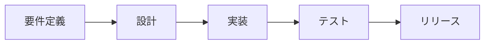

# Project-B 概要

## ステータス

> [!NOTE]
> このプロジェクトは現在準備中です。

## 予定内容

- アーキテクチャ設計
- 業務フロー（Mermaid）
- API仕様
- DB設計

## スケジュール

```mermaid
graph LR
    A[要件定義] --> B[設計]
    B --> C[実装]
    C --> D[テスト]
    D --> E[リリース]
```
