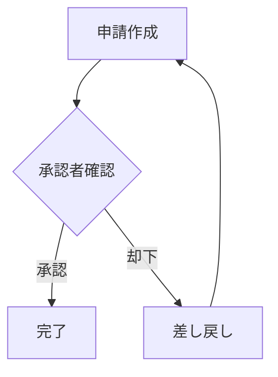
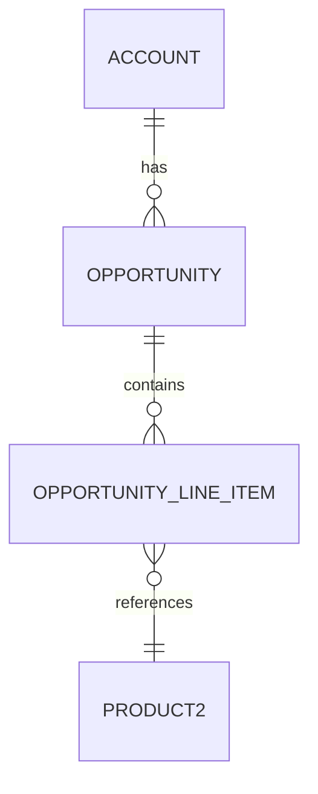
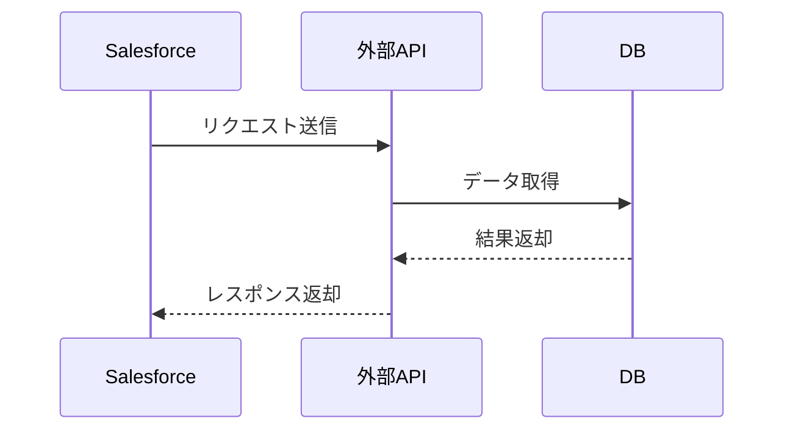
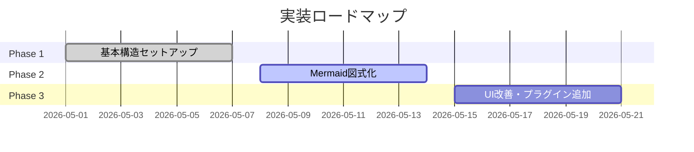

# 業務フロー

## 承認ワークフロー

**説明**：
- Step 1: 申請者が申請を作成
- Step 2: 承認者が内容確認
- Step 3: 承認→完了、却下→差し戻し

---

## Salesforce オブジェクト関係図

---

## 外部API連携フロー

---

## プロジェクトスケジュール

---

> [!IMPORTANT]
> フロー図は実際の業務仕様に合わせて更新してください。

> [!NOTE]
> Mermaid の記法については [公式ドキュメント](https://mermaid.js.org/) を参照してください。
