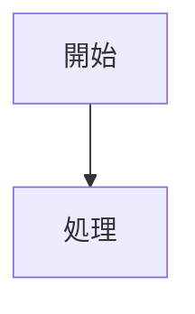

# ベストプラクティス

運用上のコツ・注意点・トラブルシューティング。

---

## Markdown 執筆のコツ

### 1. 見出しの階層を正しく

```markdown
# 見出し1（ページタイトル）← 1ファイルに1つだけ

## 見出し2（セクション）
### 見出し3（小セクション）
#### 見出し4以下は避ける
```

**理由**：
- `subMaxLevel: 3` で H3 までしかサイドバーに展開されない
- ページ内 TOC も H2/H3 を前提に設計

### 2. 説明の前に図を置く

```markdown
## 業務フロー

[フロー図を先に表示]


**説明**：
- Step 1: ...
- Step 2: ...
```

**理由**：非エンジニアは図から理解を始める

### 3. コード例には言語を必須

```markdown
❌ 悪い例
```
def hello():
    print('Hello')
```

✅ 良い例
```python
def hello():
    print('Hello')
```
```

**理由**：構文ハイライトが効き、可読性向上

---

## Git 運用のコツ

### 1. 頻度を決める

```bash
# 毎日の更新
git add docs/
git commit -m "Update design docs"
git push

# または週1回まとめて
git add docs/
git commit -m "Weekly docs update: Add flows, update APIs"
git push
```

### 2. コミットメッセージの規則

```
🔧 タイプを先頭に
  docs: Update API specification
  feat: Add Project-C
  fix: Correct typo in glossary

✅ 詳細を含める
  docs: Update Salesforce API v2.0
  - Add new endpoints
  - Update error codes

❌ 曖昧なメッセージ
  update
  fix bug
  change
```

### 3. 大きな変更は PR（GitHub/GitLab）で

```bash
# ブランチを切る
git checkout -b docs/add-project-c

# 編集・コミット
git add docs/project-c/
git commit -m "docs: Add Project-C structure"

# PR を作成
git push -u origin docs/add-project-c
# → GitHub で PR を作成
```

---

## Docsify 運用のコツ

### 1. キャッシュ対策

ブラウザキャッシュが残ると古い内容が表示される可能性。

```bash
# ハードリフレッシュ（開発中）
Ctrl+Shift+R   (Windows)
Cmd+Shift+R    (Mac)

# またはプライベートブラウジングで確認
```

### 2. `_sidebar.md` の更新を忘れない

新しいファイルを作成したら、必ず `_sidebar.md` にリンクを追加。

```markdown
✅ 正しい
- **Salesforce**
  - [API仕様](salesforce/apis.md)          ← リンク追加
  - [New Document](salesforce/new-doc.md)  ← 新規ファイル

❌ よくあるミス
# new-doc.md を作成したが _sidebar.md に追加忘れ
# → サイドバーから見つからない
```

### 3. ファイル削除時の確認

ファイルを削除する前に、どこから参照されているか確認。

```bash
# grep で参照を検索
grep -r "old-file.md" docs/
```

---

## 非エンジニア向けドキュメント作成のコツ

### 1. 図を最優先

```markdown
❌ テキストのみ
このAPIはリクエストを受け取り、データベースをクエリして、
結果をJSONで返します。エラー時は404を返します。

✅ 図 + テキスト
[シーケンス図で処理の流れを視覚化]

**ステップ**：
1. リクエストを受け取る
2. データベースをクエリ
3. 結果を JSON で返す
4. エラー時は 404 を返す
```

### 2. アラート表示で重要度を示す

```markdown
> [!WARNING]
> **本番環境では必ずこれを確認してください**

> [!NOTE]
> **参考**: 詳細は別セクションを参照

> [!TIP]
> **効率化**: この方法でより高速に実行できます
```

### 3. テーブル形式で比較

```markdown
| Salesforce | Heroku |
|-----------|--------|
| CRM プラットフォーム | PaaS |
| クラウドネイティブ | コンテナベース |
| カスタマイズ性高 | シンプル構成 |
```

---

## トラブルシューティング

### Q: GitHub Pages で公開されない

**A:** 以下を確認
1. `Settings` → `Pages` → Branch: `main`, Folder: `docs` に設定
2. リポジトリが Public か（Pages は Private リポジトリでも使用可だが、確認を）
3. `docs/.nojekyll` が存在するか
4. 数分待つ（反映に時間がかかる場合がある）

### Q: Markdown が反映されない

**A:** 以下を確認
1. ファイルを保存したか
2. `git push` したか
3. ブラウザキャッシュをクリア（Cmd+Shift+R）
4. `_sidebar.md` にリンクを追加したか

### Q: リンク先が 「Not Found」

**A:** ファイルパスを確認
```
docs/salesforce/apis.md
    ↓
_sidebar.md に記載: (salesforce/apis.md)
```

相対パスが正しいか、ファイル名は存在するか確認。

### Q: サイドバーが長すぎて見づらい

**A:** サブサイドバーを導入
- 各プロジェクトフォルダに `_sidebar.md` を配置
- ページ遷移時に自動切り替え
- （詳細は「フォルダ構造設計」を参照）

---

## チェックリスト（定期確認）

### 月次

- [ ] Markdown ファイルが最新状態か
- [ ] リンク切れはないか（grep で確認）
- [ ] セキュリティ情報（パスワード等）が含まれていないか

### 新規プロジェクト追加時

- [ ] フォルダ構成が標準形式か
- [ ] `_sidebar.md` が作成されているか
- [ ] 全体の `_sidebar.md` に追加されているか
- [ ] `_navbar.md` に追加されているか
- [ ] ローカル（`http://localhost:3000`）で動作確認したか

### リリース前

- [ ] Mermaid 図が正しく描画されているか
- [ ] アラート表示が機能しているか
- [ ] ページ内 TOC が表示されているか
- [ ] 検索機能が動作しているか
- [ ] モバイルで表示確認したか

---

> [!IMPORTANT]
> セキュリティ情報（API キー、パスワード、社外秘情報）を含めてはいけません。

> [!TIP]
> `.gitignore` に `docs/.docsify/` を追加しておくと、ローカル環境特有のファイルをコミットしません。

> [!NOTE]
> チーム全体で「Markdown の書き方」「コミットメッセージの規則」などを定める「開発標準」ドキュメントを `common/standards.md` に記載するのがおすすめです。
