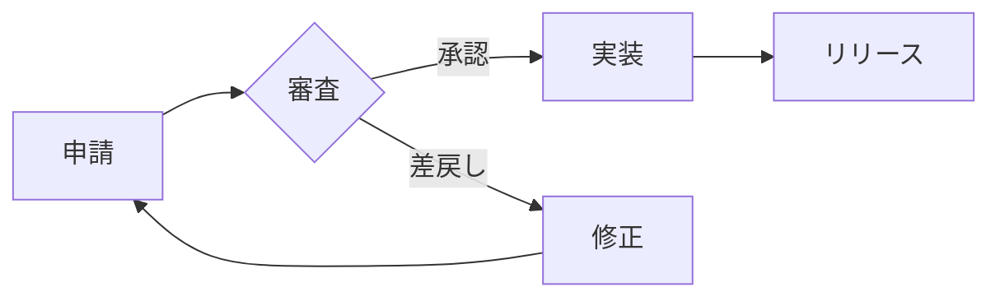

<!-- tabs:start -->

#### **改訂履歴**

| 版 | 日付 | 内容 |
|----|------|------|
| 1.0 | 2026-05-10 | 初版 |
| 0.9 | 2026-05-01 | ドラフト |

#### **概要**

本ページは **タブ UI のみ** で構成するサンプルです。`<!-- tabs:start -->` ～ `<!-- tabs:end -->` の内側だけが表示領域になり、改訂履歴・概要・処理フローを切り替えて閲覧します。

- サイドバーから本ファイルへ遷移したとき、既定では先頭タブが表示されます
- 各タブは独立した Markdown ブロックとして記述します

#### **処理フロー**

<!-- tabs:end -->
